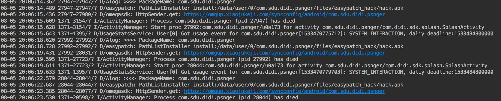
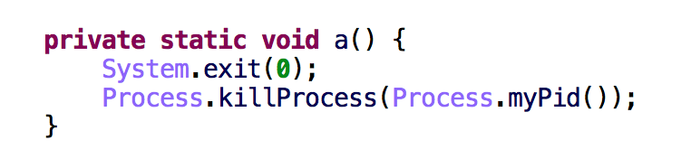
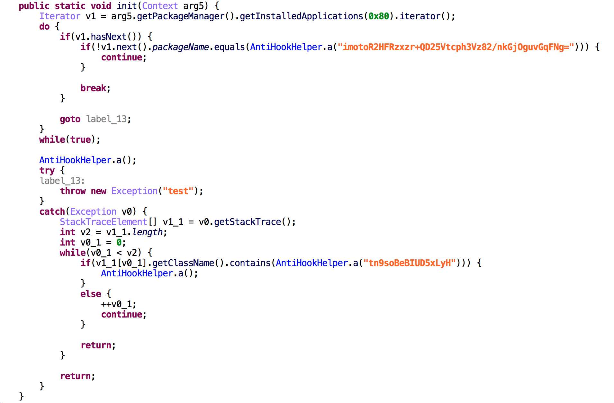

最近发现 **滴滴出行** 更新到 **5.2.12** 版本之后在有Xposed环境下的手机无法运行，一直卡在启动界面。 于是自己开始下面的分析了。

### 查看日志输出
通过日志发现，滴滴出行进入第一个界面之后就一直循环的重启。


### 查看源代码
通过日志发现程序循环的重启，程序自己杀死自己导致的。于是自己开始在反编译代码查找kill自己的相关的代码。 在搜索 ``Process.killProcess();`` 这个方法时，发现一个有趣的类名为 ``AntiHookHelper`` ( **包含Hook关键字** )中有一个kill自己的方法。



继续搜索调用这个方法的代码中发现了,程序遍历了手机所有的App列表，判断了相应的包名是否等于一个被加密的字符串。以及自己抛了一个异常并通过获取异常的堆栈的类包来判断相应的类名否等于一个被加密的字符串。



### 编写Hook代码
为了得到加密的字符串的明文信息,于是自己编写了下面的Hook的代码。

```
XposedHelpers.findAndHookMethod(
                "com.didi.sdk.apm.AntiHookHelper",
                param.classLoader,
                "a",
                String.class,
                new XC_MethodHook() {
                    @Override
                    protected void afterHookedMethod(MethodHookParam param) throws Throwable {
                        super.afterHookedMethod(param);      
                        Alog.d(">>>>>>>>>>>> " + param.args[0] + " >> " + param.getResult());
                    }
                }
        );   
```
* 被加密字符串 ``imotoR2HFRzxzr+QD25Vtcph3Vz82/nkGjOguvGqFNg=`` 的明文为 ``de.robv.android.xposed.installer``
* 被加密字符串 ``tn9soBeBIUD5xLyH`` 的明文为 ``XposedBridge``

至此可以确认 **滴滴出行** 就是通过这些 **Xposed** 特征来判断手机环境的。为了跳过检测于是自己通过下面的Hook代码直接不执行 ``init()`` 方法的代码，这样 **滴滴出行** 可正常在有 **Xposed** 环境运行了。

```
XposedHelpers.findAndHookMethod(
                "com.didi.sdk.apm.AntiHookHelper",
                param.classLoader,
                "init",
                new XC_MethodReplacement() {
                    @Override
                    protected Object replaceHookedMethod(MethodHookParam param) throws Throwable {
                        return null;
                    }
                }
        );
```


