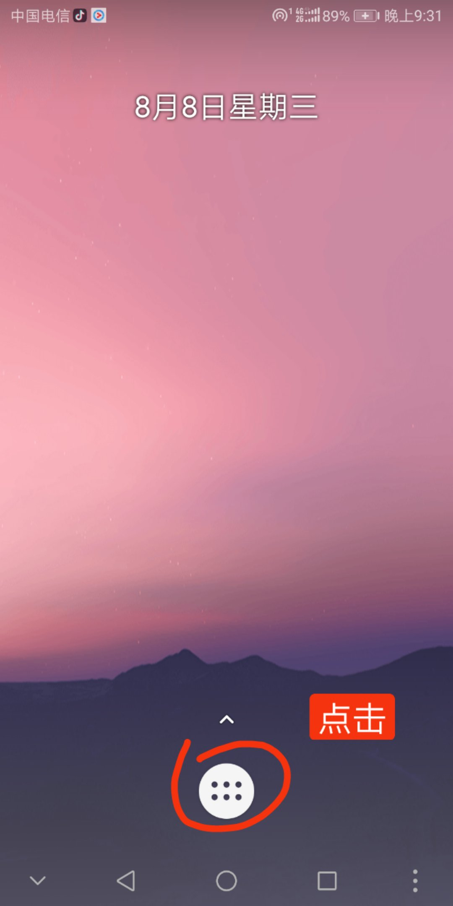
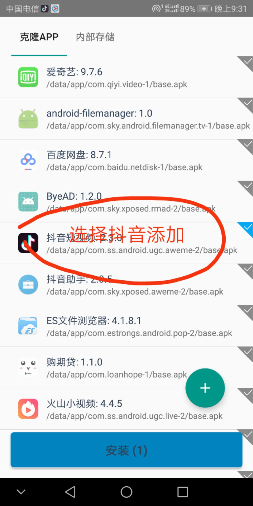
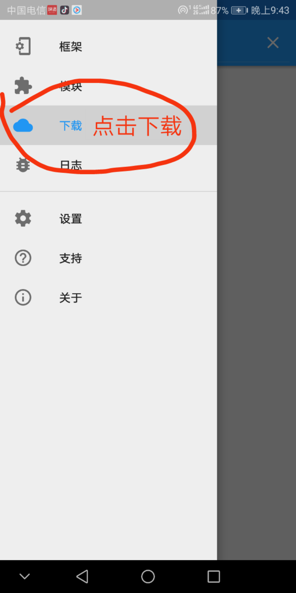
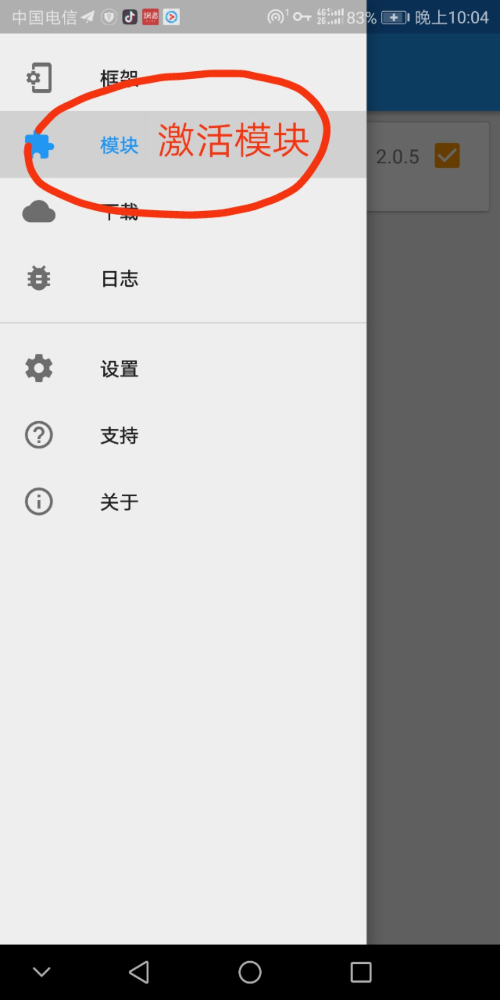

本教程主要讲解如何在 **VirtualXposed** 中使用 **抖音助手**              
   
### 准备

下载下面软件并安装到手机上  

1. [VirtualXposed](https://github.com/android-hacker/VirtualXposed/releases)  
2. [抖音](https://www.douyin.com/)

### 在 VirtualXposed 安装 抖音

### 在 VirtualXposed 安装 抖音助手

### 打开抖音使用抖音助手

